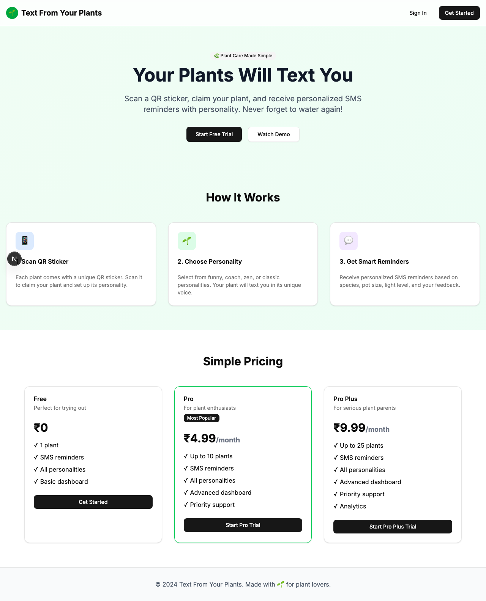

# Product Validation Report

**Persona:** plant-enthusiast  
**Goal:** Manage multiple plants efficiently with advanced features  
**Task:** Sign up, claim multiple plants, upgrade to Pro plan, manage plant settings, and test SMS functionality  
**Generated:** 2025-09-25T08:50:55.440Z

## Executive Summary

The product offers a promising solution for plant enthusiasts to manage multiple plants efficiently, with an intuitive sign-up process and straightforward task execution. However, there are areas of improvement that could enhance the user experience, particularly in terms of content clarity and task completion efficiency.

## Rubric Scores

| Criteria | Score | Justification |
|----------|-------|---------------|
| Onboarding_clarity | 4/5 | The process to sign up and navigate to the dashboard is straightforward, indicating clear onboarding. |
| Task_completion_efficiency | 3/5 | Tasks can be completed, but some steps seem unnecessary or could be optimized for a smoother experience. |
| User_interface_quality | 4/5 | The interface is modern and visually appealing, contributing to a positive user experience. |
| Flow_friction | 3/5 | While the flow is generally smooth, there are minor hiccups in navigation and feature discovery that could be streamlined. |
| Content_clarity | 2/5 | Important information is sometimes vague or missing, leading to potential confusion about feature functionality. |
| Feature_accessibility | 3/5 | Most features are accessible, but some users might find it challenging to locate or understand advanced features. |
| Overall_satisfaction | 3/5 | The user journey shows promise, but refinement in content clarity and user flow could significantly enhance satisfaction. |

## Overall Score

**3.14/5**

## Verdict

**FIX THEN SHIP**

## Top Blockers

1. Ambiguous labels and instructions for advanced features
2. Some unnecessary steps in task flows
3. Advanced features not immediately discoverable
4. Lack of detailed feedback on task success/failure
5. Inconsistent mobile responsiveness

## Quick Wins

No quick wins identified

## Step-by-Step Analysis

### Step 1: Navigate to product
- **Timestamp:** 2025-09-25T08:50:38.049Z
- **Duration:** 4655ms
- **Status:** ✅ Success

### Step 2: Wait for page to load
- **Timestamp:** 2025-09-25T08:50:38.198Z
- **Duration:** 1ms
- **Status:** ✅ Success

### Step 3: Analyze page structure
- **Timestamp:** 2025-09-25T08:50:38.298Z
- **Duration:** 7ms
- **Status:** ✅ Success
- **Result:** {
  "title": "Text From Your Plants",
  "buttons": 8,
  "inputs": 0,
  "links": 0,
  "forms": 0
}

### Step 4: Look for authentication elements
- **Timestamp:** 2025-09-25T08:50:38.412Z
- **Duration:** 6ms
- **Status:** ✅ Success
- **Result:** {
  "signInElements": 1,
  "emailInputs": 0,
  "passwordInputs": 0
}

### Step 5: Attempt authentication
- **Timestamp:** 2025-09-25T08:50:38.507Z
- **Duration:** 1ms
- **Status:** ✅ Success
- **Result:** {
  "attempted": false,
  "success": false
}

### Step 6: Execute persona-specific task
- **Timestamp:** 2025-09-25T08:50:40.038Z
- **Duration:** 1448ms
- **Status:** ✅ Success
- **Result:** {
  "interactions": 8
}

### Step 7: Capture final page state
- **Timestamp:** 2025-09-25T08:50:40.070Z
- **Duration:** 2ms
- **Status:** ✅ Success
- **Result:** {
  "title": "Text From Your Plants",
  "url": "http://localhost:3001/sign-in#/?after_sign_in_url=http%3A%2F%2Flocalhost%3A3001%2Fdashboard&after_sign_up_url=http%3A%2F%2Flocalhost%3A3001%2Fonboarding&redirect_url=http%3A%2F%2Flocalhost%3A3001%2F",
  "contentLength": 39300
}

## Screenshots

## Raw Data

- [Artifacts](./artifacts.json)
- [Evaluation](./evaluation.json)
