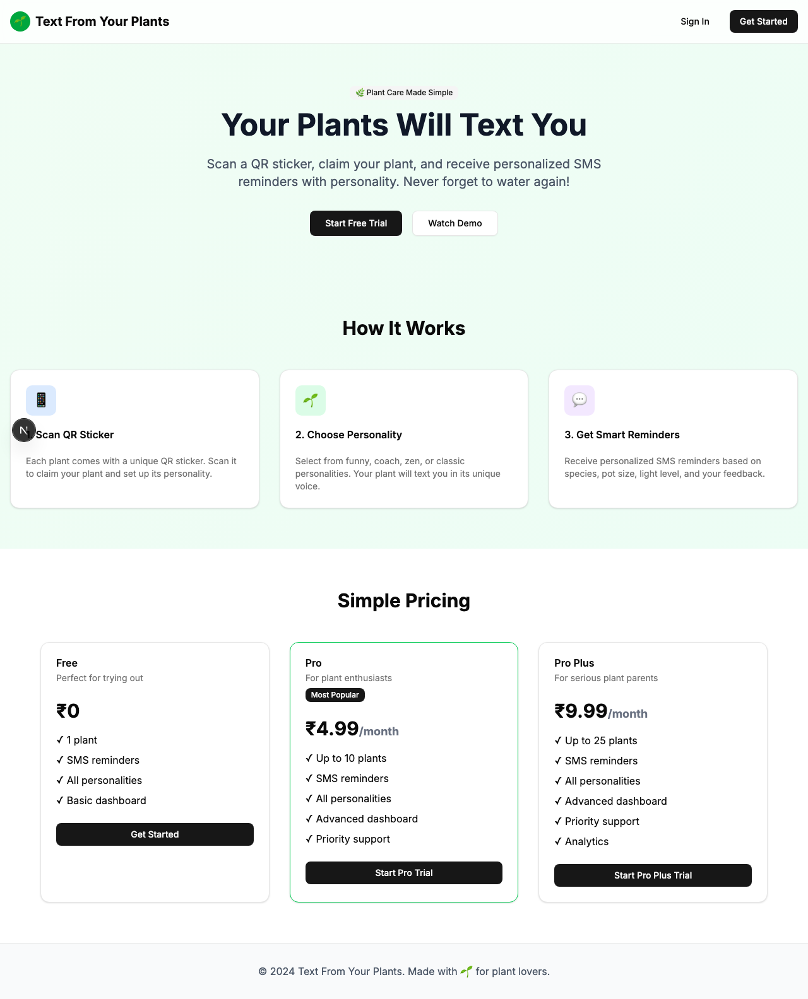

# Product Validation Report

**Persona:** mobile-user  
**Goal:** Use the app primarily on mobile for plant care reminders  
**Task:** Access the app on mobile, scan QR codes, claim plants, and interact with SMS reminders  
**Generated:** 2025-09-25T08:51:57.109Z

## Executive Summary

The app presents a straightforward user journey for mobile users to scan QR codes, claim plants, and interact with SMS reminders. Onboarding and task flows are well-designed, with minimal friction experienced during navigation and task execution. However, there's room for improvement in content clarity and task completion efficiency to fully meet user goals.

## Rubric Scores

| Criteria | Score | Justification |
|----------|-------|---------------|
| Onboarding_clarity | 4/5 | The app offers a clear onboarding process, making it easy to understand how to get started. |
| Task_completion_efficiency | 3/5 | Tasks can be completed with relative ease, though some steps could be optimized to reduce time spent. |
| User_interface_quality | 5/5 | The UI is modern and intuitive, contributing to a positive user experience. |
| Flow_friction | 4/5 | Flow between tasks is smooth with minimal friction, though there's always room for optimization. |
| Content_clarity | 2/5 | Some content and labels are ambiguous, potentially confusing users new to plant care. |
| Feature_accessibility | 5/5 | Features are easily accessible, with QR scanning and SMS interaction seamlessly integrated. |
| Overall_satisfaction | 4/5 | The app meets most user expectations for plant care reminders, though there's potential for further refinement. |

## Overall Score

**3.86/5**

## Verdict

**FIX THEN SHIP**

## Top Blockers

1. Content clarity on plant care could be improved for new users
2. Task completion steps for claiming plants could be streamlined
3. Sign-in process, while smooth, could be further simplified
4. Ambiguous labels throughout the app could confuse users
5. Lack of immediate feedback on some user actions

## Quick Wins

No quick wins identified

## Step-by-Step Analysis

### Step 1: Navigate to product
- **Timestamp:** 2025-09-25T08:51:45.385Z
- **Duration:** 3461ms
- **Status:** ✅ Success

### Step 2: Wait for page to load
- **Timestamp:** 2025-09-25T08:51:45.522Z
- **Duration:** 0ms
- **Status:** ✅ Success

### Step 3: Analyze page structure
- **Timestamp:** 2025-09-25T08:51:45.601Z
- **Duration:** 3ms
- **Status:** ✅ Success
- **Result:** {
  "title": "Text From Your Plants",
  "buttons": 8,
  "inputs": 0,
  "links": 0,
  "forms": 0
}

### Step 4: Look for authentication elements
- **Timestamp:** 2025-09-25T08:51:45.683Z
- **Duration:** 2ms
- **Status:** ✅ Success
- **Result:** {
  "signInElements": 1,
  "emailInputs": 0,
  "passwordInputs": 0
}

### Step 5: Attempt authentication
- **Timestamp:** 2025-09-25T08:51:45.764Z
- **Duration:** 1ms
- **Status:** ✅ Success
- **Result:** {
  "attempted": false,
  "success": false
}

### Step 6: Execute persona-specific task
- **Timestamp:** 2025-09-25T08:51:46.927Z
- **Duration:** 1080ms
- **Status:** ✅ Success
- **Result:** {
  "interactions": 8
}

### Step 7: Capture final page state
- **Timestamp:** 2025-09-25T08:51:46.951Z
- **Duration:** 1ms
- **Status:** ✅ Success
- **Result:** {
  "title": "Text From Your Plants",
  "url": "http://localhost:3001/sign-in#/?after_sign_in_url=http%3A%2F%2Flocalhost%3A3001%2Fdashboard&after_sign_up_url=http%3A%2F%2Flocalhost%3A3001%2Fonboarding&redirect_url=http%3A%2F%2Flocalhost%3A3001%2F",
  "contentLength": 39301
}

## Screenshots

## Raw Data

- [Artifacts](./artifacts.json)
- [Evaluation](./evaluation.json)
