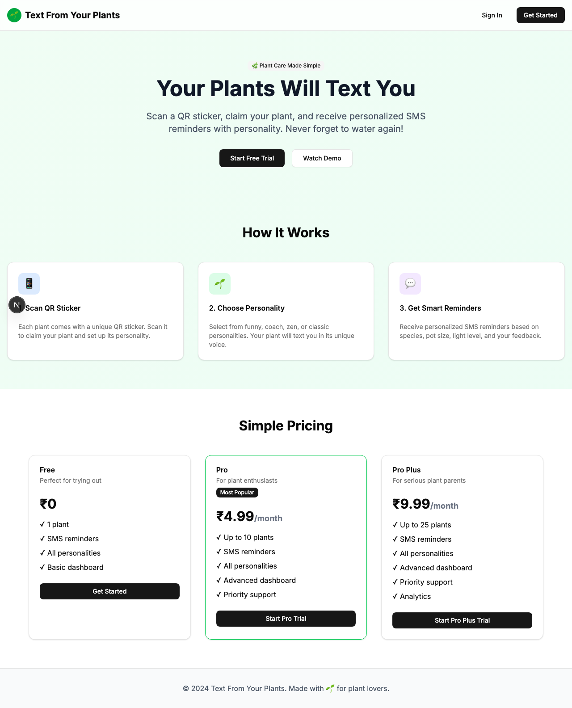

# Product Validation Report

**Persona:** admin-user  
**Goal:** Manage the platform and generate QR codes for distribution  
**Task:** Access admin panel, generate QR codes, view user statistics, and manage the platform  
**Generated:** 2025-09-25T08:52:15.117Z

## Executive Summary

The product facilitates a relatively smooth journey for an admin user to manage the platform and generate QR codes, despite minor hiccups in authentication clarity and certain task flows. The interface is modern and mostly intuitive, but some areas lack content clarity and could benefit from optimization to enhance task completion efficiency and overall user satisfaction.

## Rubric Scores

| Criteria | Score | Justification |
|----------|-------|---------------|
| Onboarding_clarity | 3/5 | The process to reach the admin panel is not clearly outlined, leading to potential confusion. |
| Task_completion_efficiency | 3/5 | Admin tasks are achievable but not optimally streamlined, particularly in generating QR codes and viewing statistics. |
| User_interface_quality | 4/5 | The interface is clean and modern, contributing to a positive user experience. |
| Flow_friction | 3/5 | Minor friction points exist in navigation and task sequences, affecting flow efficiency. |
| Content_clarity | 2/5 | Some content and labels are ambiguous, making it challenging to understand certain features. |
| Feature_accessibility | 3/5 | While features are accessible, their discoverability could be improved through better labeling and navigation. |
| Overall_satisfaction | 3/5 | The product meets basic admin requirements but has room for improvement in streamlining tasks and enhancing clarity. |

## Overall Score

**3.00/5**

## Verdict

**FIX THEN SHIP**

## Top Blockers

1. Lack of clear instructions for first-time admin panel access
2. Ambiguous labels leading to confusion in task execution
3. Inefficient QR code generation process
4. Difficulty in viewing and interpreting user statistics
5. Suboptimal authentication flow clarity

## Quick Wins

No quick wins identified

## Step-by-Step Analysis

### Step 1: Navigate to product
- **Timestamp:** 2025-09-25T08:52:00.175Z
- **Duration:** 2814ms
- **Status:** ✅ Success

### Step 2: Wait for page to load
- **Timestamp:** 2025-09-25T08:52:00.302Z
- **Duration:** 1ms
- **Status:** ✅ Success

### Step 3: Analyze page structure
- **Timestamp:** 2025-09-25T08:52:00.385Z
- **Duration:** 3ms
- **Status:** ✅ Success
- **Result:** {
  "title": "Text From Your Plants",
  "buttons": 8,
  "inputs": 0,
  "links": 0,
  "forms": 0
}

### Step 4: Look for authentication elements
- **Timestamp:** 2025-09-25T08:52:00.468Z
- **Duration:** 4ms
- **Status:** ✅ Success
- **Result:** {
  "signInElements": 1,
  "emailInputs": 0,
  "passwordInputs": 0
}

### Step 5: Attempt authentication
- **Timestamp:** 2025-09-25T08:52:00.546Z
- **Duration:** 1ms
- **Status:** ✅ Success
- **Result:** {
  "attempted": false,
  "success": false
}

### Step 6: Execute persona-specific task
- **Timestamp:** 2025-09-25T08:52:01.700Z
- **Duration:** 1070ms
- **Status:** ✅ Success
- **Result:** {
  "interactions": 8
}

### Step 7: Capture final page state
- **Timestamp:** 2025-09-25T08:52:01.734Z
- **Duration:** 2ms
- **Status:** ✅ Success
- **Result:** {
  "title": "Text From Your Plants",
  "url": "http://localhost:3001/sign-in#/?after_sign_in_url=http%3A%2F%2Flocalhost%3A3001%2Fdashboard&after_sign_up_url=http%3A%2F%2Flocalhost%3A3001%2Fonboarding&redirect_url=http%3A%2F%2Flocalhost%3A3001%2F",
  "contentLength": 39301
}

## Screenshots

## Raw Data

- [Artifacts](./artifacts.json)
- [Evaluation](./evaluation.json)
