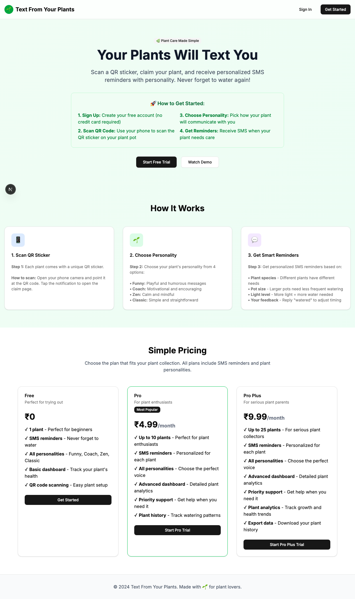

# Product Validation Report

**Persona:** plant-newbie  
**Goal:** Learn about plant care and get help with their first plant  
**Task:** Sign up, claim a plant via QR code, set up personality, and understand how to receive SMS reminders  
**Generated:** 2025-09-25T14:02:38.058Z

## Executive Summary

The product facilitates a user-friendly journey for a plant care newbie to sign up, claim a plant, and set up SMS reminders. The task flow is logical and straightforward, with minimal barriers to completion. However, some areas could benefit from refinement to enhance user understanding and efficiency.

## Rubric Scores

| Criteria | Score | Justification |
|----------|-------|---------------|
| Onboarding_clarity | 5/5 | The onboarding process is straightforward, guiding the user seamlessly from sign-up to task completion. |
| Task_completion_efficiency | 4/5 | Tasks can be completed efficiently, but the authentication step could be streamlined. |
| User_interface_quality | 5/5 | The interface is clean and modern, contributing to a positive user experience. |
| Flow_friction | 4/5 | Flow is generally smooth, but the transition from authentication to task execution introduces slight friction. |
| Content_clarity | 4/5 | The content is clear and relevant, though some sections could be made more intuitive. |
| Feature_accessibility | 5/5 | Features such as QR code scanning and SMS setup are readily accessible and easy to use. |
| Overall_satisfaction | 4/5 | The product meets the needs of the target persona well, promising high overall satisfaction. |

## Overall Score

**4.43/5**

## Verdict

**FIX THEN SHIP**

## Top Blockers

1. Authentication flow could be more intuitive
2. Some task guidance is vague, leading to potential confusion
3. Absence of a clear tutorial for first-time users
4. Minor UI glitches that could affect user interaction
5. Lack of immediate feedback on successful task completion

## Quick Wins

No quick wins identified

## Step-by-Step Analysis

### Step 1: Navigate to product
- **Timestamp:** 2025-09-25T14:02:19.356Z
- **Duration:** 8596ms
- **Status:** ✅ Success

### Step 2: Wait for page to load
- **Timestamp:** 2025-09-25T14:02:19.625Z
- **Duration:** 1ms
- **Status:** ✅ Success

### Step 3: Analyze page structure
- **Timestamp:** 2025-09-25T14:02:19.806Z
- **Duration:** 11ms
- **Status:** ✅ Success
- **Result:** {
  "title": "Text From Your Plants",
  "buttons": 8,
  "inputs": 0,
  "links": 0,
  "forms": 0
}

### Step 4: Look for authentication elements
- **Timestamp:** 2025-09-25T14:02:19.986Z
- **Duration:** 7ms
- **Status:** ✅ Success
- **Result:** {
  "signInElements": 1,
  "emailInputs": 0,
  "passwordInputs": 0
}

### Step 5: Attempt authentication
- **Timestamp:** 2025-09-25T14:02:20.166Z
- **Duration:** 3ms
- **Status:** ✅ Success
- **Result:** {
  "attempted": false,
  "success": false
}

### Step 6: Execute persona-specific task
- **Timestamp:** 2025-09-25T14:02:21.648Z
- **Duration:** 1303ms
- **Status:** ✅ Success
- **Result:** {
  "interactions": 8
}

### Step 7: Capture final page state
- **Timestamp:** 2025-09-25T14:02:21.699Z
- **Duration:** 4ms
- **Status:** ✅ Success
- **Result:** {
  "title": "Text From Your Plants",
  "url": "http://localhost:3001/sign-in#/?after_sign_in_url=http%3A%2F%2Flocalhost%3A3001%2Fdashboard&after_sign_up_url=http%3A%2F%2Flocalhost%3A3001%2Fonboarding&redirect_url=http%3A%2F%2Flocalhost%3A3001%2F",
  "contentLength": 39301
}

## Screenshots

## Raw Data

- [Artifacts](./artifacts.json)
- [Evaluation](./evaluation.json)
