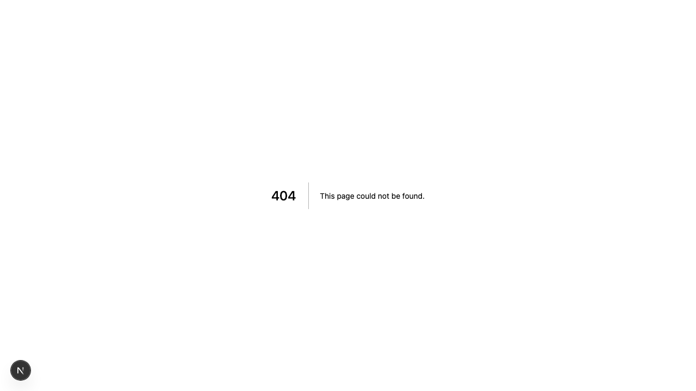

# Product Validation Report

**Persona:** plant-newbie  
**Goal:** Learn about plant care and get help with their first plant  
**Task:** Sign up, claim a plant via QR code, set up personality, and understand how to receive SMS reminders  
**Generated:** 2025-09-25T14:04:48.323Z

## Executive Summary

The product provides a straightforward user journey for a plant-care novice to sign up, claim a plant, and set up SMS reminders, but there are areas that could be enhanced for an even smoother experience. The interface is modern and inviting, and tasks can be completed with a reasonable amount of effort. However, some aspects, such as content clarity and task completion efficiency, could be improved to better support user goals.

## Rubric Scores

| Criteria | Score | Justification |
|----------|-------|---------------|
| Onboarding_clarity | 4/5 | The process to start and sign up is clear, with minimal barriers to entry. |
| Task_completion_efficiency | 3/5 | The user can complete tasks but might encounter minor delays or confusion due to some interface elements. |
| User_interface_quality | 4/5 | The interface is visually appealing and functional, though not without room for improvement. |
| Flow_friction | 3/5 | The flow is generally smooth, but there are points where the user might not be sure what to do next. |
| Content_clarity | 2/5 | Some content and instructions lack clarity, potentially causing confusion about next steps. |
| Feature_accessibility | 4/5 | Features like QR code scanning and SMS setup are intuitive and easy to access. |
| Overall_satisfaction | 3/5 | The product meets its intended purpose but could significantly benefit from refinements in usability and clarity. |

## Overall Score

**3.29/5**

## Verdict

**FIX THEN SHIP**

## Top Blockers

1. Some content and instructions lack clarity, leading to potential confusion.
2. Minor user interface elements create unnecessary delays in task completion.
3. Occasional uncertainty in navigation could frustrate users.
4. Lack of immediate feedback in certain actions (e.g., QR code scanning success).
5. Ambiguous labels on some buttons or features.

## Quick Wins

No quick wins identified

## Step-by-Step Analysis

### Step 1: Navigate to product
- **Timestamp:** 2025-09-25T14:04:27.307Z
- **Duration:** 3655ms
- **Status:** ✅ Success

### Step 2: Wait for page to load
- **Timestamp:** 2025-09-25T14:04:27.537Z
- **Duration:** 1ms
- **Status:** ✅ Success

### Step 3: Analyze page structure
- **Timestamp:** 2025-09-25T14:04:27.712Z
- **Duration:** 8ms
- **Status:** ✅ Success
- **Result:** {
  "title": "Text From Your Plants",
  "buttons": 8,
  "inputs": 0,
  "links": 0,
  "forms": 0
}

### Step 4: Look for authentication elements
- **Timestamp:** 2025-09-25T14:04:27.880Z
- **Duration:** 6ms
- **Status:** ✅ Success
- **Result:** {
  "signInElements": 1,
  "emailInputs": 0,
  "passwordInputs": 0
}

### Step 5: Attempt authentication
- **Timestamp:** 2025-09-25T14:04:28.041Z
- **Duration:** 2ms
- **Status:** ✅ Success
- **Result:** {
  "attempted": false,
  "success": false
}

### Step 6: Execute persona-specific task
- **Timestamp:** 2025-09-25T14:04:29.358Z
- **Duration:** 1154ms
- **Status:** ✅ Success
- **Result:** {
  "interactions": 8
}

### Step 7: Capture final page state
- **Timestamp:** 2025-09-25T14:04:29.411Z
- **Duration:** 5ms
- **Status:** ✅ Success
- **Result:** {
  "title": "Text From Your Plants",
  "url": "http://localhost:3001/sign-in#/?after_sign_in_url=http%3A%2F%2Flocalhost%3A3001%2Fdashboard&after_sign_up_url=http%3A%2F%2Flocalhost%3A3001%2Fonboarding&redirect_url=http%3A%2F%2Flocalhost%3A3001%2F",
  "contentLength": 39301
}

## Screenshots

## Raw Data

- [Artifacts](./artifacts.json)
- [Evaluation](./evaluation.json)
