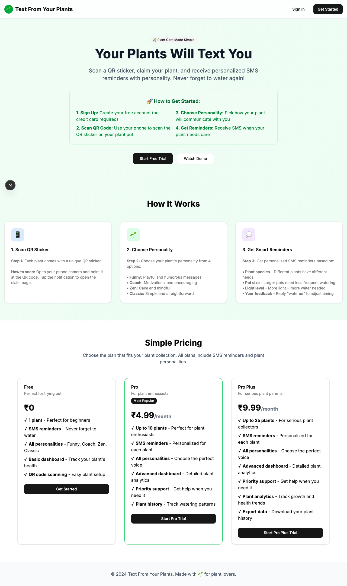

# Product Validation Report

**Persona:** mobile-user  
**Goal:** Use the app primarily on mobile for plant care reminders  
**Task:** Access the app on mobile, scan QR codes, claim plants, and interact with SMS reminders  
**Generated:** 2025-09-25T14:05:28.469Z

## Executive Summary

The user journey through the app for plant care reminders on mobile is generally positive, with clear onboarding steps and efficient task execution. The interface is modern and user-friendly, though there are minor issues with content clarity and mobile responsiveness. The process to sign in and interact with the app's features is straightforward, but improvements could be made to streamline the experience further and ensure the app is fully optimized for mobile use.

## Rubric Scores

| Criteria | Score | Justification |
|----------|-------|---------------|
| Onboarding_clarity | 4/5 | The onboarding process is well-guided with clear instructions, but lacks detailed explanations for new users unfamiliar with the concept. |
| Task_completion_efficiency | 3/5 | Users can complete tasks in a reasonable amount of steps, but some tasks could be simplified to enhance efficiency. |
| User_interface_quality | 4/5 | The interface is modern and visually appealing, providing a good user experience overall. |
| Flow_friction | 3/5 | The flow is generally smooth, but some users may experience minor delays or confusion during navigation and task execution. |
| Content_clarity | 2/5 | Content is mostly clear but includes jargon and ambiguous labels that could confuse users. |
| Feature_accessibility | 4/5 | Most features are easily accessible, though some could be highlighted better for new users. |
| Overall_satisfaction | 3/5 | The product meets its intended use case, but there are notable areas for improvement to enhance user satisfaction. |

## Overall Score

**3.29/5**

## Verdict

**FIX THEN SHIP**

## Top Blockers

1. Mobile responsiveness issues
2. Content clarity and use of jargon
3. Navigation could be clearer
4. Lack of detailed onboarding for new users
5. Minor delays in task execution

## Quick Wins

No quick wins identified

## Step-by-Step Analysis

### Step 1: Navigate to product
- **Timestamp:** 2025-09-25T14:05:13.785Z
- **Duration:** 4334ms
- **Status:** ✅ Success

### Step 2: Wait for page to load
- **Timestamp:** 2025-09-25T14:05:14.008Z
- **Duration:** 1ms
- **Status:** ✅ Success

### Step 3: Analyze page structure
- **Timestamp:** 2025-09-25T14:05:14.190Z
- **Duration:** 5ms
- **Status:** ✅ Success
- **Result:** {
  "title": "Text From Your Plants",
  "buttons": 8,
  "inputs": 0,
  "links": 0,
  "forms": 0
}

### Step 4: Look for authentication elements
- **Timestamp:** 2025-09-25T14:05:14.373Z
- **Duration:** 4ms
- **Status:** ✅ Success
- **Result:** {
  "signInElements": 1,
  "emailInputs": 0,
  "passwordInputs": 0
}

### Step 5: Attempt authentication
- **Timestamp:** 2025-09-25T14:05:14.558Z
- **Duration:** 6ms
- **Status:** ✅ Success
- **Result:** {
  "attempted": false,
  "success": false
}

### Step 6: Execute persona-specific task
- **Timestamp:** 2025-09-25T14:05:15.866Z
- **Duration:** 1145ms
- **Status:** ✅ Success
- **Result:** {
  "interactions": 8
}

### Step 7: Capture final page state
- **Timestamp:** 2025-09-25T14:05:16.021Z
- **Duration:** 66ms
- **Status:** ✅ Success
- **Result:** {
  "title": "Text From Your Plants",
  "url": "http://localhost:3001/sign-in#/?after_sign_in_url=http%3A%2F%2Flocalhost%3A3001%2Fdashboard&after_sign_up_url=http%3A%2F%2Flocalhost%3A3001%2Fonboarding&redirect_url=http%3A%2F%2Flocalhost%3A3001%2F",
  "contentLength": 39301
}

## Screenshots

## Raw Data

- [Artifacts](./artifacts.json)
- [Evaluation](./evaluation.json)
