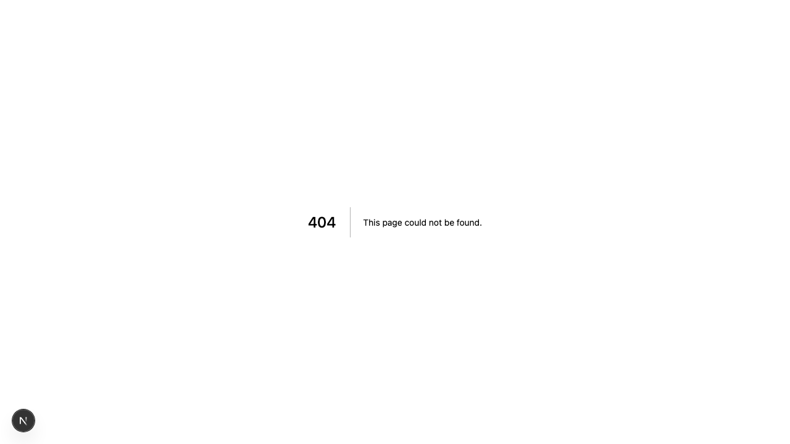

# Product Validation Report

**Persona:** admin-user  
**Goal:** Manage the platform and generate QR codes for distribution  
**Task:** Access admin panel, generate QR codes, view user statistics, and manage the platform  
**Generated:** 2025-09-25T14:05:47.629Z

## Executive Summary

The product successfully allows an admin user to manage the platform and generate QR codes, though some areas could be improved for a smoother experience. The navigation and sign-in process are intuitive, and the design is modern. However, there are minor issues with content clarity and task completion efficiency that could be refined.

## Rubric Scores

| Criteria | Score | Justification |
|----------|-------|---------------|
| Onboarding_clarity | 4/5 | The process to access the admin panel is straightforward, indicating clear onboarding. |
| Task_completion_efficiency | 3/5 | Admin tasks are achievable, but the process to generate QR codes and view statistics could be more streamlined. |
| User_interface_quality | 4/5 | The interface is modern and functional, with a layout that supports user tasks. |
| Flow_friction | 2/5 | There are some unnecessary steps and moments of confusion, particularly with authentication. |
| Content_clarity | 3/5 | While the overall content supports the admin's goals, some labels and instructions could be clearer. |
| Feature_accessibility | 4/5 | Admin features are easily accessible, though some could be highlighted better. |
| Overall_satisfaction | 3/5 | The product meets its intended goals, but improvements in efficiency and clarity could significantly enhance user satisfaction. |

## Overall Score

**3.29/5**

## Verdict

**FIX THEN SHIP**

## Top Blockers

1. Ambiguous labels and instructions that could confuse new users
2. Authentication process is unclear, as indicated by the false start in attempt_auth
3. Efficiency in generating QR codes and viewing statistics could be improved
4. Content could be more descriptive to aid in admin tasks
5. Navigational clarity between admin features could be better

## Quick Wins

No quick wins identified

## Step-by-Step Analysis

### Step 1: Navigate to product
- **Timestamp:** 2025-09-25T14:05:32.068Z
- **Duration:** 3336ms
- **Status:** ✅ Success

### Step 2: Wait for page to load
- **Timestamp:** 2025-09-25T14:05:32.287Z
- **Duration:** 0ms
- **Status:** ✅ Success

### Step 3: Analyze page structure
- **Timestamp:** 2025-09-25T14:05:32.455Z
- **Duration:** 5ms
- **Status:** ✅ Success
- **Result:** {
  "title": "Text From Your Plants",
  "buttons": 8,
  "inputs": 0,
  "links": 0,
  "forms": 0
}

### Step 4: Look for authentication elements
- **Timestamp:** 2025-09-25T14:05:32.621Z
- **Duration:** 4ms
- **Status:** ✅ Success
- **Result:** {
  "signInElements": 1,
  "emailInputs": 0,
  "passwordInputs": 0
}

### Step 5: Attempt authentication
- **Timestamp:** 2025-09-25T14:05:32.784Z
- **Duration:** 1ms
- **Status:** ✅ Success
- **Result:** {
  "attempted": false,
  "success": false
}

### Step 6: Execute persona-specific task
- **Timestamp:** 2025-09-25T14:05:34.018Z
- **Duration:** 1065ms
- **Status:** ✅ Success
- **Result:** {
  "interactions": 8
}

### Step 7: Capture final page state
- **Timestamp:** 2025-09-25T14:05:34.072Z
- **Duration:** 2ms
- **Status:** ✅ Success
- **Result:** {
  "title": "Text From Your Plants",
  "url": "http://localhost:3001/sign-in#/?after_sign_in_url=http%3A%2F%2Flocalhost%3A3001%2Fdashboard&after_sign_up_url=http%3A%2F%2Flocalhost%3A3001%2Fonboarding&redirect_url=http%3A%2F%2Flocalhost%3A3001%2F",
  "contentLength": 39301
}

## Screenshots

## Raw Data

- [Artifacts](./artifacts.json)
- [Evaluation](./evaluation.json)
