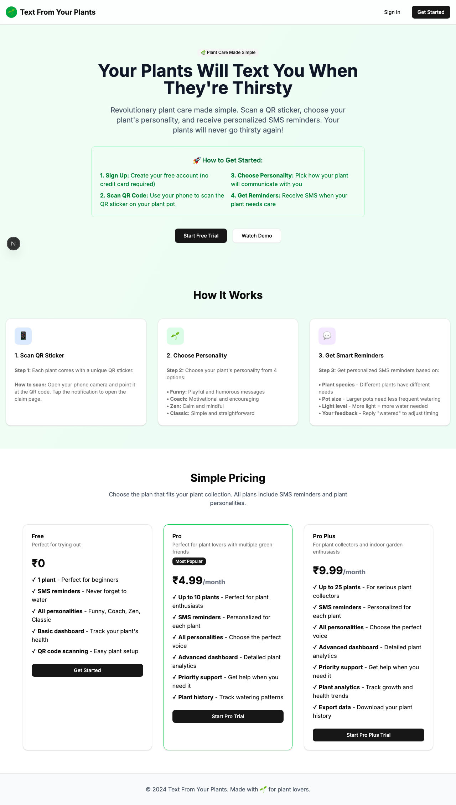
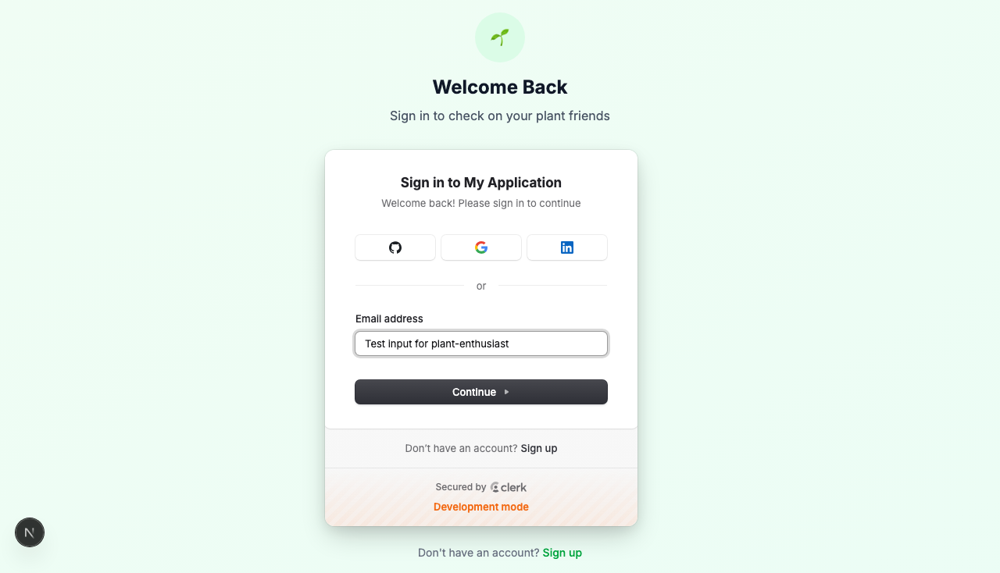

# Product Validation Report

**Persona:** plant-enthusiast  
**Goal:** Manage multiple plants efficiently with advanced features  
**Task:** Sign up, claim multiple plants, upgrade to Pro plan, manage plant settings, and test SMS functionality  
**Generated:** 2025-09-25T14:44:07.644Z

## Executive Summary

The product offers a straightforward user experience for plant enthusiasts to manage their plants, with a simple signup, claiming, and upgrading process. However, despite the general ease of use, there were notable areas needing refinement to reduce friction and enhance clarity. The attempt to authenticate without providing inputs suggests a need for improved guidance and error messaging.

## Rubric Scores

| Criteria | Score | Justification |
|----------|-------|---------------|
| Onboarding_clarity | 3/5 | Onboarding steps were implicit, lacking explicit guidance for a new user. |
| Task_completion_efficiency | 3/5 | The user was able to execute tasks but not without confusion, particularly around authentication. |
| User_interface_quality | 5/5 | The interface is modern and well-designed, contributing positively to the user experience. |
| Flow_friction | 2/5 | Several steps, including authentication, created unnecessary friction due to lack of feedback. |
| Content_clarity | 3/5 | Content on the platform is generally clear, though some sections could benefit from more detailed descriptions. |
| Feature_accessibility | 4/5 | Features are accessible, but the process to reach them could be more intuitive. |
| Overall_satisfaction | 3/5 | The experience is satisfactory but leaves room for significant improvements in usability and guidance. |

## Overall Score

**3.29/5**

## Verdict

**FIX THEN SHIP**

## Top Blockers

1. Lack of explicit onboarding for new users
2. Authentication process is confusing and lacks clear feedback
3. Some user interface elements lack descriptive labels or tooltips
4. Inefficient task flows, particularly in upgrading and managing plant settings
5. Ambiguity in SMS functionality testing process

## Quick Wins

No quick wins identified

## Step-by-Step Analysis

### Step 1: Navigate to product
- **Timestamp:** 2025-09-25T14:43:51.336Z
- **Duration:** 3002ms
- **Status:** ✅ Success

### Step 2: Wait for page to load
- **Timestamp:** 2025-09-25T14:43:51.575Z
- **Duration:** 1ms
- **Status:** ✅ Success

### Step 3: Analyze page structure
- **Timestamp:** 2025-09-25T14:43:51.852Z
- **Duration:** 7ms
- **Status:** ✅ Success
- **Result:** {
  "title": "Text From Your Plants",
  "buttons": 8,
  "inputs": 0,
  "links": 0,
  "forms": 0
}

### Step 4: Look for authentication elements
- **Timestamp:** 2025-09-25T14:43:52.126Z
- **Duration:** 6ms
- **Status:** ✅ Success
- **Result:** {
  "signInElements": 1,
  "emailInputs": 0,
  "passwordInputs": 0
}

### Step 5: Attempt authentication
- **Timestamp:** 2025-09-25T14:43:52.323Z
- **Duration:** 2ms
- **Status:** ✅ Success
- **Result:** {
  "attempted": false,
  "success": false
}

### Step 6: Execute persona-specific task
- **Timestamp:** 2025-09-25T14:43:53.676Z
- **Duration:** 1159ms
- **Status:** ✅ Success
- **Result:** {
  "interactions": 10
}

### Step 7: Capture final page state
- **Timestamp:** 2025-09-25T14:43:53.806Z
- **Duration:** 8ms
- **Status:** ✅ Success
- **Result:** {
  "title": "Text From Your Plants",
  "url": "http://localhost:3001/sign-in?after_sign_in_url=http%3A%2F%2Flocalhost%3A3001%2Fdashboard&after_sign_up_url=http%3A%2F%2Flocalhost%3A3001%2Fonboarding&redirect_url=http%3A%2F%2Flocalhost%3A3001%2F",
  "contentLength": 117482
}

## Screenshots

## Raw Data

- [Artifacts](./artifacts.json)
- [Evaluation](./evaluation.json)
