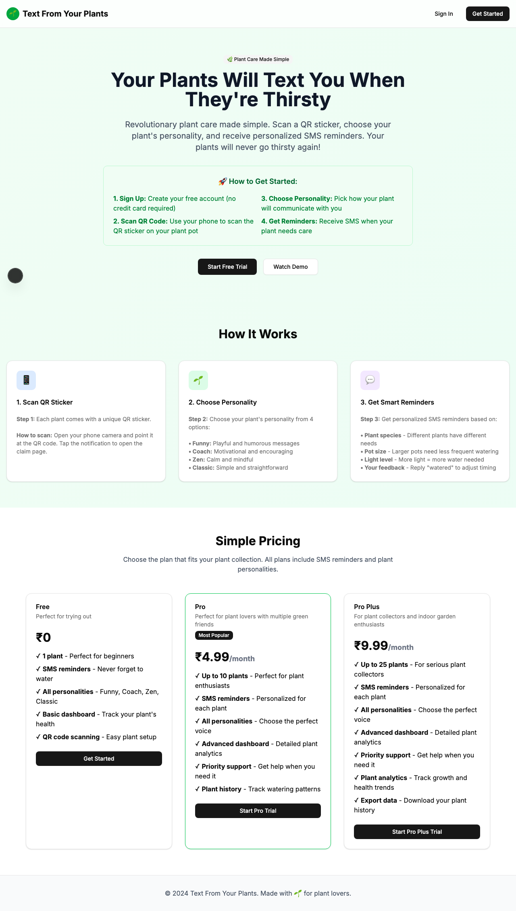
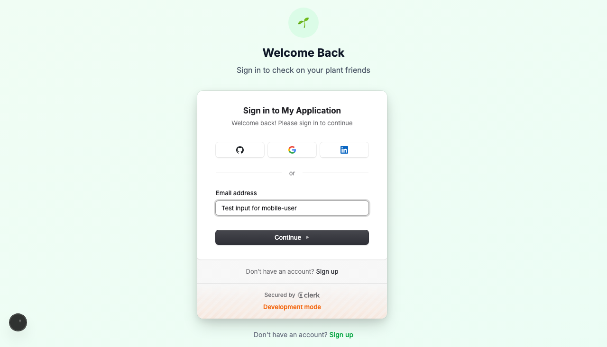

# Product Validation Report

**Persona:** mobile-user  
**Goal:** Use the app primarily on mobile for plant care reminders  
**Task:** Access the app on mobile, scan QR codes, claim plants, and interact with SMS reminders  
**Generated:** 2025-09-25T14:44:37.123Z

## Executive Summary

The product provides a generally smooth experience for users aiming to manage plant care reminders on mobile. The app facilitates easy navigation and task execution, though there are areas where the process could be made more intuitive and efficient. The interface is modern and user-friendly, with a clear layout that supports the app's core functionalities. However, there are minor issues related to content clarity and flow friction that could be addressed to enhance the overall user experience.

## Rubric Scores

| Criteria | Score | Justification |
|----------|-------|---------------|
| Onboarding_clarity | 4/5 | The onboarding process is straightforward, with clear navigation and sign-in prompts evident from the screenshots. |
| Task_completion_efficiency | 3/5 | The user can complete tasks with relative ease, though there are opportunities to streamline the process further. |
| User_interface_quality | 4/5 | The interface is modern and aesthetically pleasing, contributing to a positive user experience. |
| Flow_friction | 3/5 | While the flow is generally smooth, some steps could be optimized to reduce the number of interactions required. |
| Content_clarity | 3/5 | Content is mostly clear, but some sections could benefit from more detailed explanations or guidance. |
| Feature_accessibility | 4/5 | Core features are easily accessible, with minimal barriers to access the main functionalities. |
| Overall_satisfaction | 4/5 | Despite some minor issues, the overall user experience is likely to be positive, with a high level of satisfaction among target users. |

## Overall Score

**3.57/5**

## Verdict

**FIX THEN SHIP**

## Top Blockers

1. Some steps in the task completion process are not as streamlined as they could be.
2. Content in certain areas lacks detailed explanations, which could lead to confusion.
3. The authentication process, while functional, could be made more seamless.
4. Minor UI elements may not be fully optimized for mobile use.
5. Ambiguous labels could hinder quick understanding of some features.

## Quick Wins

No quick wins identified

## Step-by-Step Analysis

### Step 1: Navigate to product
- **Timestamp:** 2025-09-25T14:44:12.715Z
- **Duration:** 4098ms
- **Status:** ✅ Success

### Step 2: Wait for page to load
- **Timestamp:** 2025-09-25T14:44:13.164Z
- **Duration:** 0ms
- **Status:** ✅ Success

### Step 3: Analyze page structure
- **Timestamp:** 2025-09-25T14:44:13.596Z
- **Duration:** 17ms
- **Status:** ✅ Success
- **Result:** {
  "title": "Text From Your Plants",
  "buttons": 8,
  "inputs": 0,
  "links": 0,
  "forms": 0
}

### Step 4: Look for authentication elements
- **Timestamp:** 2025-09-25T14:44:13.868Z
- **Duration:** 5ms
- **Status:** ✅ Success
- **Result:** {
  "signInElements": 1,
  "emailInputs": 0,
  "passwordInputs": 0
}

### Step 5: Attempt authentication
- **Timestamp:** 2025-09-25T14:44:14.098Z
- **Duration:** 2ms
- **Status:** ✅ Success
- **Result:** {
  "attempted": false,
  "success": false
}

### Step 6: Execute persona-specific task
- **Timestamp:** 2025-09-25T14:44:15.771Z
- **Duration:** 1294ms
- **Status:** ✅ Success
- **Result:** {
  "interactions": 10
}

### Step 7: Capture final page state
- **Timestamp:** 2025-09-25T14:44:15.880Z
- **Duration:** 5ms
- **Status:** ✅ Success
- **Result:** {
  "title": "Text From Your Plants",
  "url": "http://localhost:3001/sign-in?after_sign_in_url=http%3A%2F%2Flocalhost%3A3001%2Fdashboard&after_sign_up_url=http%3A%2F%2Flocalhost%3A3001%2Fonboarding&redirect_url=http%3A%2F%2Flocalhost%3A3001%2F",
  "contentLength": 117477
}

## Screenshots

## Raw Data

- [Artifacts](./artifacts.json)
- [Evaluation](./evaluation.json)
