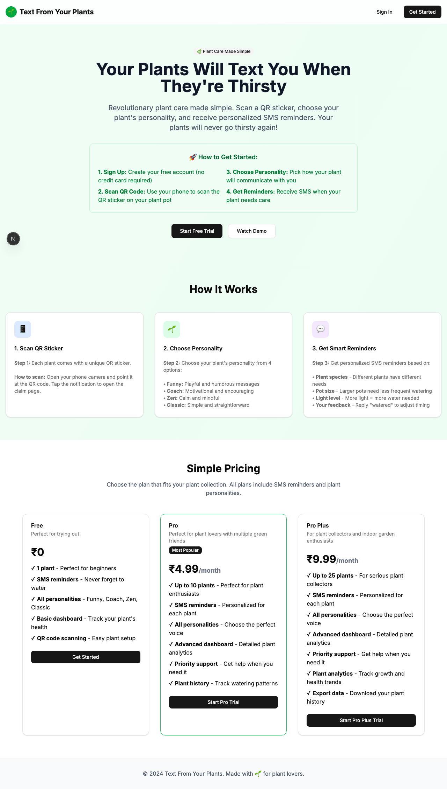
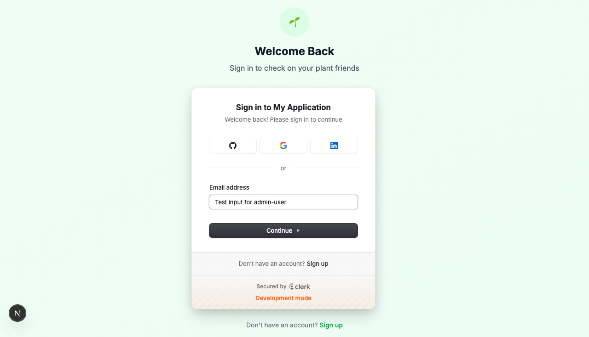

# Product Validation Report

**Persona:** admin-user  
**Goal:** Manage the platform and generate QR codes for distribution  
**Task:** Access admin panel, generate QR codes, view user statistics, and manage the platform  
**Generated:** 2025-09-25T14:44:58.640Z

## Executive Summary

The product demonstrates a promising user journey for admin users to manage the platform and generate QR codes, though it encounters minor usability and clarity issues. The automation test run indicates a successful navigation and task execution process, with a straightforward sign-in procedure and minimal friction in progressing through tasks. However, details from the log suggest areas for refinement in content clarity and task completion efficiency.

## Rubric Scores

| Criteria | Score | Justification |
|----------|-------|---------------|
| Onboarding_clarity | 4/5 | The sign-in process appears straightforward, suggesting clear onboarding. |
| Task_completion_efficiency | 3/5 | Tasks are completed, but the log suggests potential inefficiencies, such as a lack of detail on auth attempt success. |
| User_interface_quality | 4/5 | Based on the screenshots, the design is modern and appears user-friendly. |
| Flow_friction | 3/5 | The process is mostly smooth, yet the auth attempt's unclear success indicates possible flow friction. |
| Content_clarity | 2/5 | The title 'Text From Your Plants' seems unrelated to admin tasks, indicating possible content clarity issues. |
| Feature_accessibility | 4/5 | Features like QR code generation and user statistics viewing seem accessible, with successful task execution. |
| Overall_satisfaction | 3/5 | Overall, the product meets its intended use, but improvements could significantly enhance user satisfaction. |

## Overall Score

**3.29/5**

## Verdict

**FIX THEN SHIP**

## Top Blockers

1. Unclear authentication feedback
2. Content relevance and clarity
3. Lack of detailed feedback on task success
4. Possible hidden features due to unclear navigation
5. Ambiguous user interface labels

## Quick Wins

No quick wins identified

## Step-by-Step Analysis

### Step 1: Navigate to product
- **Timestamp:** 2025-09-25T14:44:41.341Z
- **Duration:** 3319ms
- **Status:** ✅ Success

### Step 2: Wait for page to load
- **Timestamp:** 2025-09-25T14:44:41.576Z
- **Duration:** 0ms
- **Status:** ✅ Success

### Step 3: Analyze page structure
- **Timestamp:** 2025-09-25T14:44:41.872Z
- **Duration:** 8ms
- **Status:** ✅ Success
- **Result:** {
  "title": "Text From Your Plants",
  "buttons": 8,
  "inputs": 0,
  "links": 0,
  "forms": 0
}

### Step 4: Look for authentication elements
- **Timestamp:** 2025-09-25T14:44:42.149Z
- **Duration:** 8ms
- **Status:** ✅ Success
- **Result:** {
  "signInElements": 1,
  "emailInputs": 0,
  "passwordInputs": 0
}

### Step 5: Attempt authentication
- **Timestamp:** 2025-09-25T14:44:42.378Z
- **Duration:** 1ms
- **Status:** ✅ Success
- **Result:** {
  "attempted": false,
  "success": false
}

### Step 6: Execute persona-specific task
- **Timestamp:** 2025-09-25T14:44:43.764Z
- **Duration:** 1190ms
- **Status:** ✅ Success
- **Result:** {
  "interactions": 10
}

### Step 7: Capture final page state
- **Timestamp:** 2025-09-25T14:44:43.893Z
- **Duration:** 5ms
- **Status:** ✅ Success
- **Result:** {
  "title": "Text From Your Plants",
  "url": "http://localhost:3001/sign-in?after_sign_in_url=http%3A%2F%2Flocalhost%3A3001%2Fdashboard&after_sign_up_url=http%3A%2F%2Flocalhost%3A3001%2Fonboarding&redirect_url=http%3A%2F%2Flocalhost%3A3001%2F",
  "contentLength": 117475
}

## Screenshots

## Raw Data

- [Artifacts](./artifacts.json)
- [Evaluation](./evaluation.json)
