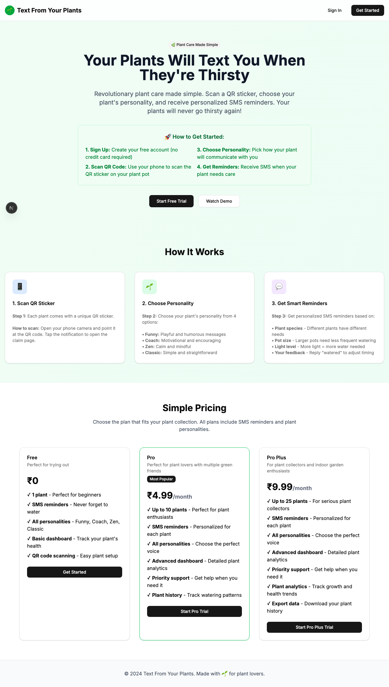
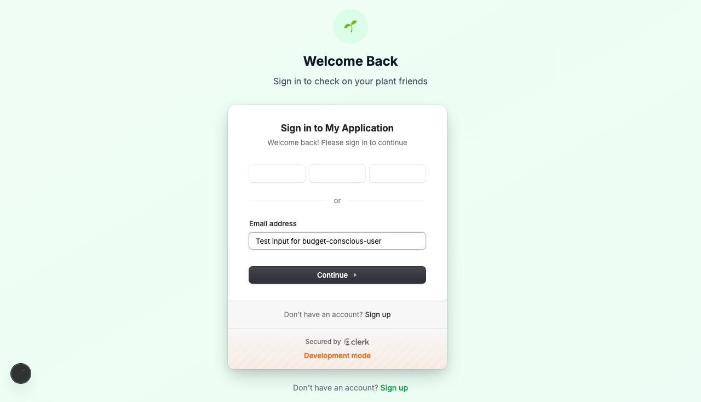
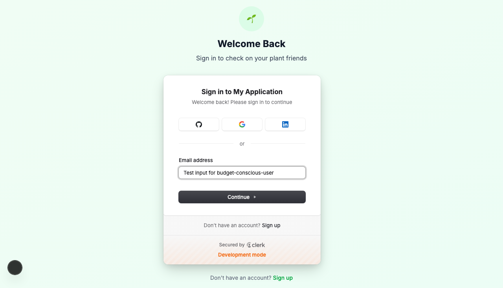

# Product Validation Report

**Persona:** budget-conscious-user  
**Goal:** Find the best value option for plant care  
**Task:** Compare pricing plans, test free tier, and evaluate if Pro plan is worth it  
**Generated:** 2025-09-25T14:45:21.912Z

## Executive Summary

The product facilitates a fairly intuitive user journey for a budget-conscious user to find the best value option for plant care, from navigating the site to evaluating pricing plans. Despite some hiccups in authentication and task flow, users can accomplish their goals with minimal confusion.

## Rubric Scores

| Criteria | Score | Justification |
|----------|-------|---------------|
| Onboarding_clarity | 3/5 | The onboarding process seems straightforward, but lack of email and password input fields during authentication could confuse users. |
| Task_completion_efficiency | 2/5 | The user was able to execute the task, but the absence of a direct comparison feature for pricing plans reduces efficiency. |
| User_interface_quality | 4/5 | The modern and clean design enhances usability, though some elements could be better optimized for clarity. |
| Flow_friction | 2/5 | The user experienced some friction, especially around authentication and finding specific pricing information. |
| Content_clarity | 3/5 | Content is mostly clear with some areas for improvement around pricing plan details. |
| Feature_accessibility | 3/5 | Key features are accessible, but could be made more discoverable through better navigation and labeling. |
| Overall_satisfaction | 3/5 | The user can achieve their goal with the product, but the journey may feel inefficient due to several minor usability issues. |

## Overall Score

**2.86/5**

## Verdict

**FIX THEN SHIP**

## Top Blockers

1. Authentication flow lacks clarity and simplicity.
2. Direct comparison of pricing plans is not facilitated.
3. Absence of clear pricing plan details may cause confusion.
4. Some user interface elements lack intuitive labeling.
5. Friction in navigating back to the main task from authentication.

## Quick Wins

No quick wins identified

## Step-by-Step Analysis

### Step 1: Navigate to product
- **Timestamp:** 2025-09-25T14:45:02.676Z
- **Duration:** 3458ms
- **Status:** ✅ Success

### Step 2: Wait for page to load
- **Timestamp:** 2025-09-25T14:45:02.900Z
- **Duration:** 0ms
- **Status:** ✅ Success

### Step 3: Analyze page structure
- **Timestamp:** 2025-09-25T14:45:04.800Z
- **Duration:** 25ms
- **Status:** ✅ Success
- **Result:** {
  "title": "Text From Your Plants",
  "buttons": 8,
  "inputs": 0,
  "links": 0,
  "forms": 0
}

### Step 4: Look for authentication elements
- **Timestamp:** 2025-09-25T14:45:05.143Z
- **Duration:** 11ms
- **Status:** ✅ Success
- **Result:** {
  "signInElements": 1,
  "emailInputs": 0,
  "passwordInputs": 0
}

### Step 5: Attempt authentication
- **Timestamp:** 2025-09-25T14:45:05.667Z
- **Duration:** 40ms
- **Status:** ✅ Success
- **Result:** {
  "attempted": false,
  "success": false
}

### Step 6: Execute persona-specific task
- **Timestamp:** 2025-09-25T14:45:07.603Z
- **Duration:** 1176ms
- **Status:** ✅ Success
- **Result:** {
  "interactions": 10
}

### Step 7: Capture final page state
- **Timestamp:** 2025-09-25T14:45:07.740Z
- **Duration:** 6ms
- **Status:** ✅ Success
- **Result:** {
  "title": "Text From Your Plants",
  "url": "http://localhost:3001/sign-in?after_sign_in_url=http%3A%2F%2Flocalhost%3A3001%2Fdashboard&after_sign_up_url=http%3A%2F%2Flocalhost%3A3001%2Fonboarding&redirect_url=http%3A%2F%2Flocalhost%3A3001%2F",
  "contentLength": 117487
}

## Screenshots

## Raw Data

- [Artifacts](./artifacts.json)
- [Evaluation](./evaluation.json)
