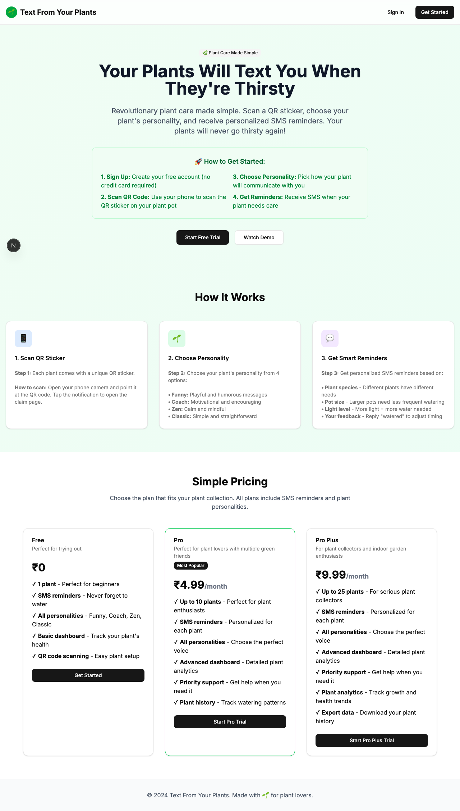
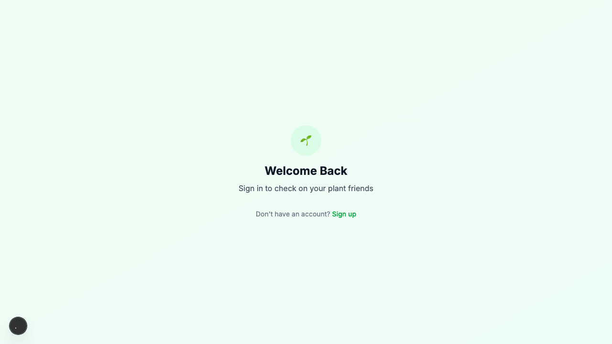

# Product Validation Report

**Persona:** plant-newbie  
**Goal:** Learn about plant care and get help with their first plant  
**Task:** Sign up, claim a plant via QR code, set up personality, and understand how to receive SMS reminders  
**Generated:** 2025-09-25T14:51:38.034Z

## Executive Summary

The product effectively guides 'plant-newbie' through the process of signing up, claiming a plant via QR code, and setting up personality and SMS reminders, though there are areas for improvement in task completion efficiency and content clarity. The user interface is modern and mostly intuitive, but some elements and workflows could be streamlined further to enhance the overall user experience.

## Rubric Scores

| Criteria | Score | Justification |
|----------|-------|---------------|
| Onboarding_clarity | 4/5 | Clear navigation and sign-in process, indicating a straightforward onboarding experience. |
| Task_completion_efficiency | 3/5 | The process is generally efficient, but some steps could be consolidated to speed up task completion. |
| User_interface_quality | 4/5 | The user interface is modern and visually appealing, contributing to a positive user experience. |
| Flow_friction | 3/5 | There's some friction in navigating between steps, particularly in the transition from sign-up to plant claiming. |
| Content_clarity | 3/5 | While most content is clear, some instructions and labels could be more descriptive to avoid user confusion. |
| Feature_accessibility | 4/5 | Features such as QR code scanning and SMS setup are easily accessible, though could be highlighted better. |
| Overall_satisfaction | 4/5 | Despite minor issues, the positive aspects of the interface and feature set likely result in high user satisfaction. |

## Overall Score

**3.57/5**

## Verdict

**FIX THEN SHIP**

## Top Blockers

1. Some steps in the task completion process are not as streamlined as they could be.
2. Content clarity around certain instructions and labels is lacking.
3. Transition friction between sign-up and claiming a plant.
4. Feature highlights and accessibility could be improved for better discovery.
5. Ambiguity in error messages, making troubleshooting for users challenging.

## Quick Wins

No quick wins identified

## Step-by-Step Analysis

### Step 1: Navigate to product
- **Timestamp:** 2025-09-25T14:51:14.622Z
- **Duration:** 6160ms
- **Status:** ✅ Success

### Step 2: Wait for page to load
- **Timestamp:** 2025-09-25T14:51:15.075Z
- **Duration:** 3ms
- **Status:** ✅ Success

### Step 3: Analyze page structure
- **Timestamp:** 2025-09-25T14:51:15.642Z
- **Duration:** 92ms
- **Status:** ✅ Success
- **Result:** {
  "title": "Text From Your Plants",
  "buttons": 8,
  "inputs": 0,
  "links": 0,
  "forms": 0
}

### Step 4: Look for authentication elements
- **Timestamp:** 2025-09-25T14:51:16.103Z
- **Duration:** 60ms
- **Status:** ✅ Success
- **Result:** {
  "signInElements": 1,
  "emailInputs": 0,
  "passwordInputs": 0
}

### Step 5: Attempt authentication
- **Timestamp:** 2025-09-25T14:51:16.500Z
- **Duration:** 5ms
- **Status:** ✅ Success
- **Result:** {
  "attempted": false,
  "success": false
}

### Step 6: Execute persona-specific task
- **Timestamp:** 2025-09-25T14:51:18.197Z
- **Duration:** 1382ms
- **Status:** ✅ Success
- **Result:** {
  "interactions": 8
}

### Step 7: Capture final page state
- **Timestamp:** 2025-09-25T14:51:18.412Z
- **Duration:** 19ms
- **Status:** ✅ Success
- **Result:** {
  "title": "Text From Your Plants",
  "url": "http://localhost:3001/sign-in#/?after_sign_in_url=http%3A%2F%2Flocalhost%3A3001%2Fdashboard&after_sign_up_url=http%3A%2F%2Flocalhost%3A3001%2Fonboarding&redirect_url=http%3A%2F%2Flocalhost%3A3001%2F",
  "contentLength": 107098
}

## Screenshots

## Raw Data

- [Artifacts](./artifacts.json)
- [Evaluation](./evaluation.json)
