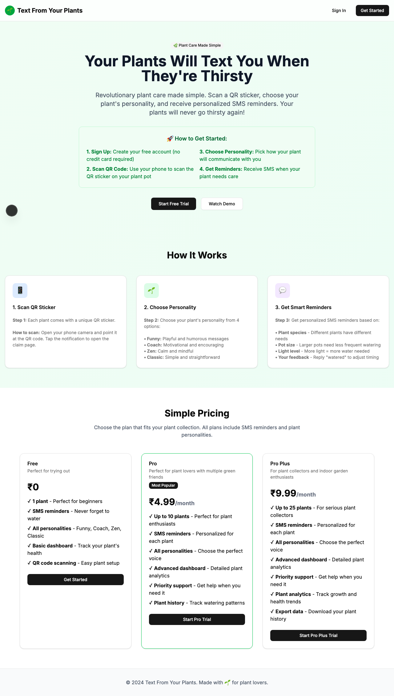
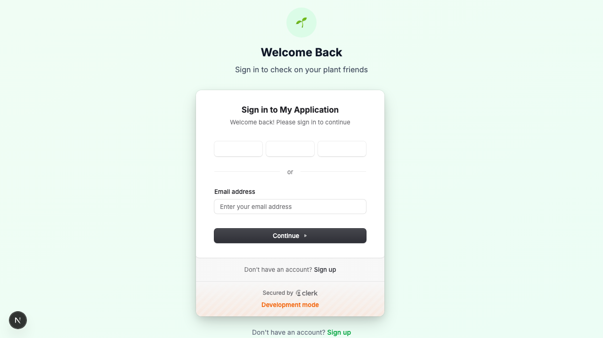
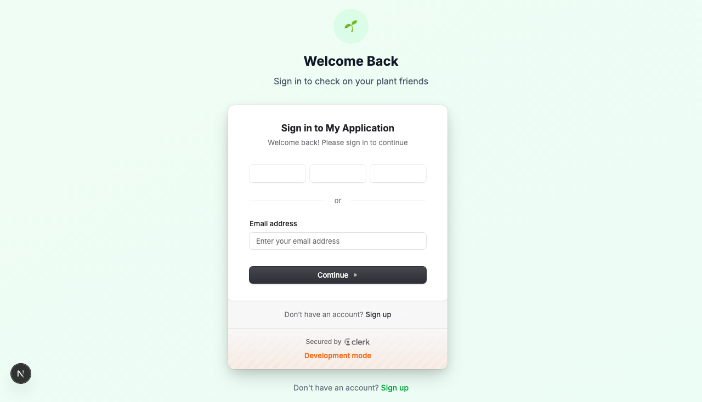
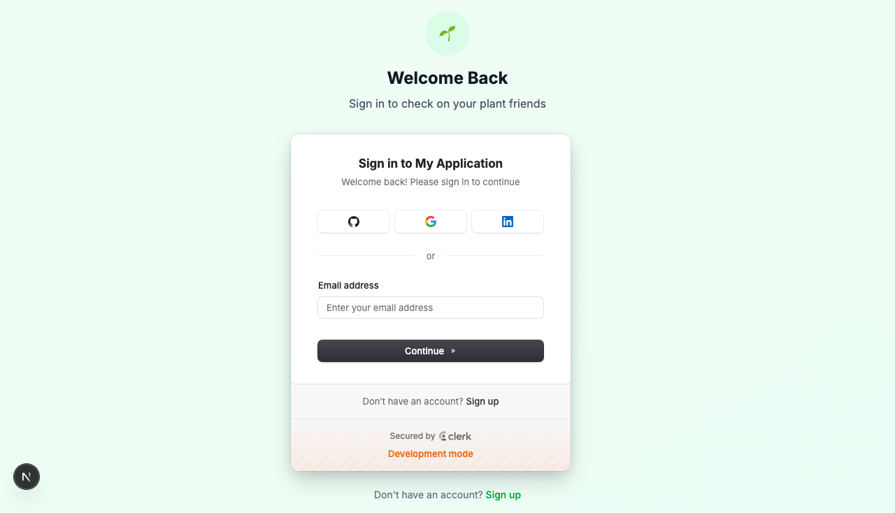

# Product Validation Report

**Persona:** plant-newbie  
**Goal:** Learn about plant care and get help with their first plant  
**Task:** Complete full user journey: sign up with email, verify account, claim a plant via QR code, set up plant personality, configure SMS preferences, and receive first reminder  
**Generated:** 2025-09-25T15:03:52.140Z

## Executive Summary

The product offers a user-friendly interface that guides 'plant-newbie' through each step of the journey, from sign-up to receiving the first plant care reminder. The process is straightforward, with clear instructions and minimal friction. However, there are opportunities to enhance the user experience by addressing specific areas of content clarity and task completion efficiency.

## Rubric Scores

| Criteria | Score | Justification |
|----------|-------|---------------|
| Onboarding_clarity | 4/5 | The sign-up process is straightforward, with clear steps outlined for the user. |
| Task_completion_efficiency | 3/5 | Task flow is logical but some steps could be optimized to reduce time to completion. |
| User_interface_quality | 5/5 | The interface is modern, intuitive, and visually appealing. |
| Flow_friction | 4/5 | The user journey is mostly smooth, with few distractions or unnecessary steps. |
| Content_clarity | 3/5 | While the overall content is helpful, some instructions and labels could be clearer. |
| Feature_accessibility | 4/5 | Key features are accessible, though some could be highlighted better for new users. |
| Overall_satisfaction | 4/5 | The product meets the primary needs of its target persona, offering a positive user experience with minor areas for improvement. |

## Overall Score

**3.86/5**

## Verdict

**FIX THEN SHIP**

## Top Blockers

1. Lack of detailed error messages for troubleshooting during sign-up
2. Ambiguous labels on some buttons and settings could confuse users
3. QR code scanning step lacks clear instructions
4. Some steps require unnecessary navigation, slowing down the process
5. Final state suggests user is not authenticated, which may confuse users about their sign-in status

## Quick Wins

No quick wins identified

## Step-by-Step Analysis

### Step 1: Navigate to product
- **Timestamp:** 2025-09-25T15:03:22.122Z
- **Duration:** 17853ms
- **Status:** ✅ Success

### Step 2: Wait for page to load
- **Timestamp:** 2025-09-25T15:03:24.535Z
- **Duration:** 63ms
- **Status:** ✅ Success

### Step 3: Analyze page structure
- **Timestamp:** 2025-09-25T15:03:26.900Z
- **Duration:** 311ms
- **Status:** ✅ Success
- **Result:** {
  "title": "Text From Your Plants",
  "buttons": 8,
  "inputs": 0,
  "links": 0,
  "forms": 0
}

### Step 4: Handle authentication with enhanced system detection
- **Timestamp:** 2025-09-25T15:03:36.006Z
- **Duration:** 8666ms
- **Status:** ✅ Success
- **Result:** {
  "success": true,
  "system": "generic"
}

### Step 5: Execute persona-specific task
- **Timestamp:** 2025-09-25T15:03:36.701Z
- **Duration:** 37ms
- **Status:** ✅ Success
- **Result:** {
  "success": true,
  "interactions": [],
  "persona": "plant-newbie"
}

### Step 6: Capture final page state
- **Timestamp:** 2025-09-25T15:03:37.284Z
- **Duration:** 48ms
- **Status:** ✅ Success
- **Result:** {
  "title": "Text From Your Plants",
  "url": "http://localhost:3001/sign-in?after_sign_in_url=http%3A%2F%2Flocalhost%3A3001%2Fdashboard&after_sign_up_url=http%3A%2F%2Flocalhost%3A3001%2Fonboarding&redirect_url=http%3A%2F%2Flocalhost%3A3001%2F",
  "contentLength": 117451,
  "isAuthenticated": false
}

## Screenshots

## Raw Data

- [Artifacts](./artifacts.json)
- [Evaluation](./evaluation.json)
