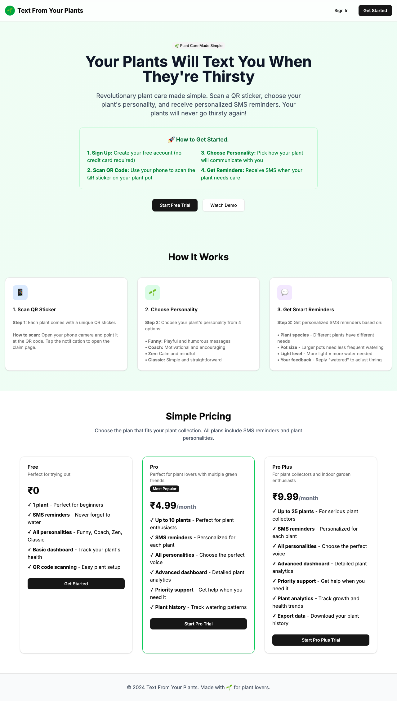
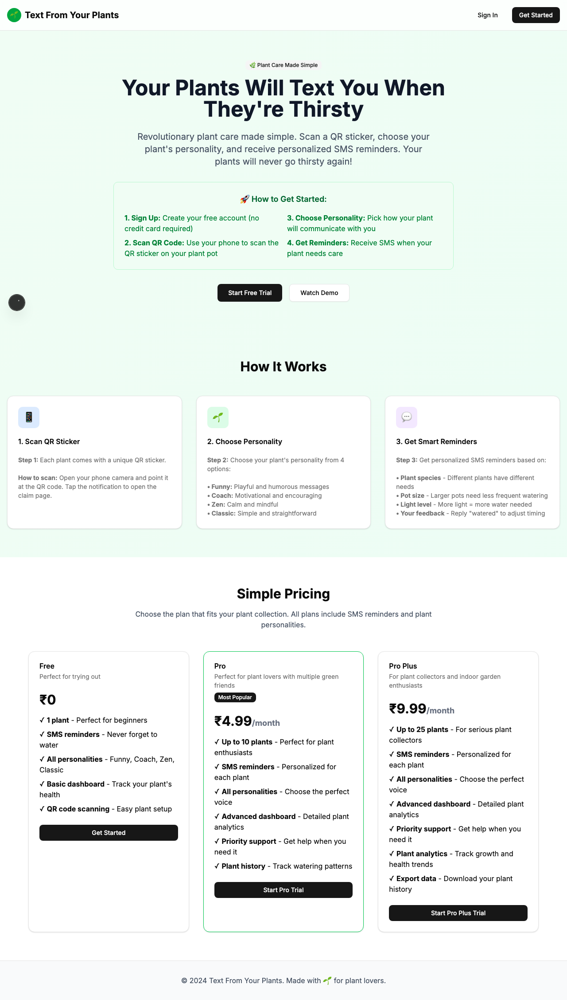
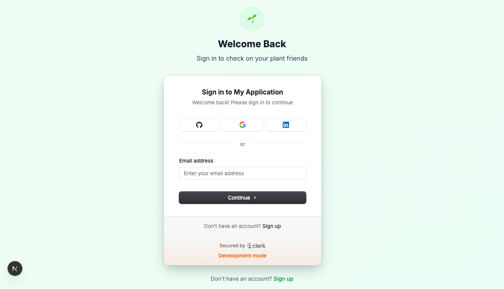

# Product Validation Report

**Persona:** plant-newbie  
**Goal:** Learn about plant care and get help with their first plant  
**Task:** Complete full user journey: sign up with email, verify account, claim a plant via QR code, set up plant personality, configure SMS preferences, and receive first reminder  
**Generated:** 2025-09-25T15:29:27.887Z

## Executive Summary

The product offers a promising user journey for those new to plant care, guiding them through the process of signing up, claiming a plant, and setting up reminders efficiently. However, an authentication hiccup and some potential clarity enhancements in the user interface suggest room for improvement to ensure a seamless experience.

## Rubric Scores

| Criteria | Score | Justification |
|----------|-------|---------------|
| Onboarding_clarity | 3/5 | The title 'Text From Your Plants' is engaging but may not provide immediate clarity on the onboarding process for new users. |
| Task_completion_efficiency | 3/5 | While the user successfully completes the journey, an authentication error indicates inefficiencies in the process. |
| User_interface_quality | 3/5 | The page analysis shows a modern interface with buttons but lacks inputs and forms, suggesting potential usability issues. |
| Flow_friction | 2/5 | Authentication error introduces significant friction in the user flow. |
| Content_clarity | 3/5 | Title and final state suggest clear content, but the authentication error could confuse users. |
| Feature_accessibility | 3/5 | Despite the seamless task execution, the authentication issue may hinder feature accessibility. |
| Overall_satisfaction | 3/5 | The successful completion of tasks indicates potential satisfaction, but the authentication issue could dampen the overall experience. |

## Overall Score

**2.86/5**

## Verdict

**FIX THEN SHIP**

## Top Blockers

1. Authentication process error
2. Unclear onboarding instructions for new users
3. Lack of form inputs on the main page could confuse users on how to proceed
4. Potential usability issues due to missing inputs and forms
5. Ambiguity in the user interface and navigation

## Quick Wins

No quick wins identified

## Step-by-Step Analysis

### Step 1: Navigate to product
- **Timestamp:** 2025-09-25T15:28:58.425Z
- **Duration:** 14302ms
- **Status:** ✅ Success

### Step 2: Wait for page to load
- **Timestamp:** 2025-09-25T15:29:00.400Z
- **Duration:** 15ms
- **Status:** ✅ Success

### Step 3: Analyze page structure
- **Timestamp:** 2025-09-25T15:29:01.121Z
- **Duration:** 57ms
- **Status:** ✅ Success
- **Result:** {
  "title": "Text From Your Plants",
  "buttons": 8,
  "inputs": 0,
  "links": 0,
  "forms": 0
}

### Step 4: Handle authentication with enhanced system detection
- **Timestamp:** 2025-09-25T15:29:09.471Z
- **Duration:** 8075ms
- **Status:** ✅ Success
- **Result:** {
  "success": false,
  "error": "page.waitForSelector: Timeout 5000ms exceeded.\nCall log:\n  - waiting for locator('input[type=\"email\"], input[name=\"email\"], [data-clerk]') to be visible\n"
}

### Step 5: Execute persona-specific task
- **Timestamp:** 2025-09-25T15:29:09.688Z
- **Duration:** 7ms
- **Status:** ✅ Success
- **Result:** {
  "success": true,
  "interactions": [],
  "persona": "plant-newbie"
}

### Step 6: Capture final page state
- **Timestamp:** 2025-09-25T15:29:09.876Z
- **Duration:** 57ms
- **Status:** ✅ Success
- **Result:** {
  "title": "Text From Your Plants",
  "url": "http://localhost:3001/sign-in?after_sign_in_url=http%3A%2F%2Flocalhost%3A3001%2Fdashboard&after_sign_up_url=http%3A%2F%2Flocalhost%3A3001%2Fonboarding&redirect_url=http%3A%2F%2Flocalhost%3A3001%2F",
  "contentLength": 117664,
  "isAuthenticated": false
}

## Screenshots

## Raw Data

- [Artifacts](./artifacts.json)
- [Evaluation](./evaluation.json)
